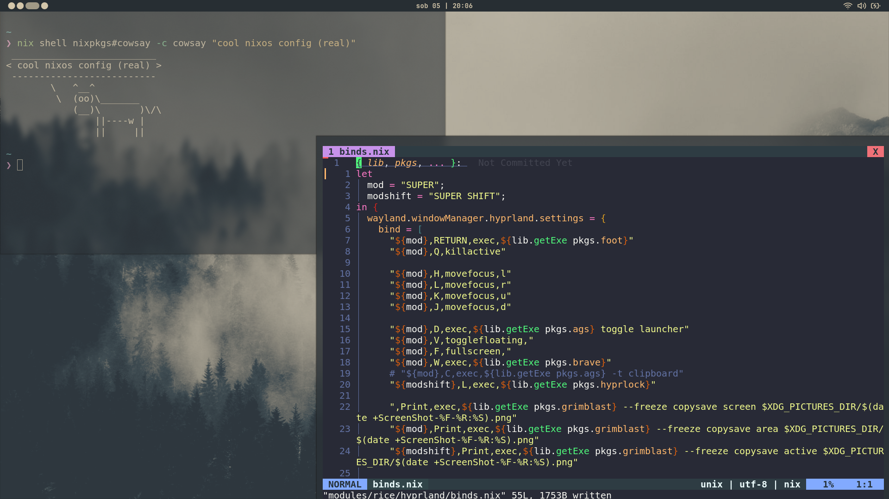

# NixOS Dotfiles
My personal NixOS dotfiles for my daily driver.

It runs Wayland and Hyprland, and the widgets are made with [Aylur's GTK Shell](https://github.com/KreconyMakaron/ags/).

---
heavily inspired by [sioodmy's config](https://github.com/sioodmy/dotfiles/), it's amazing.
