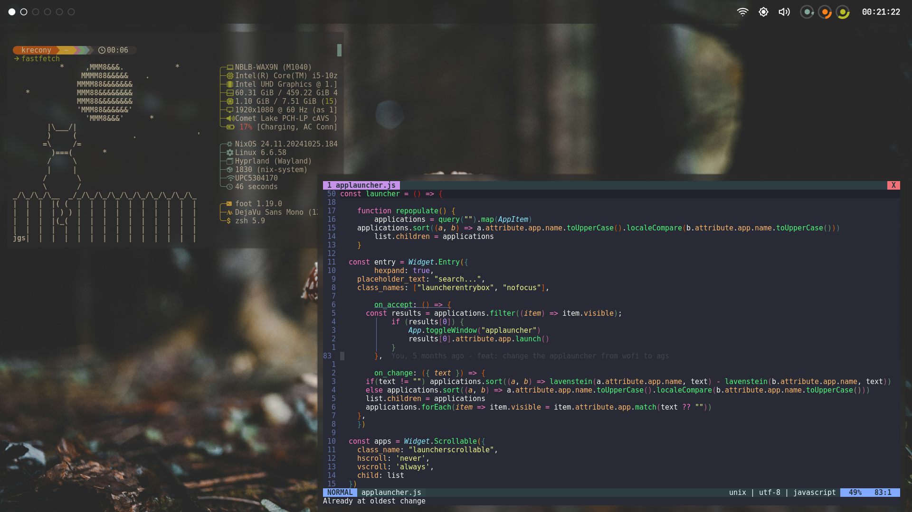
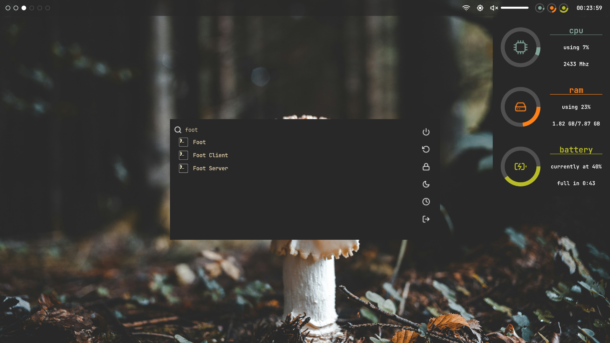
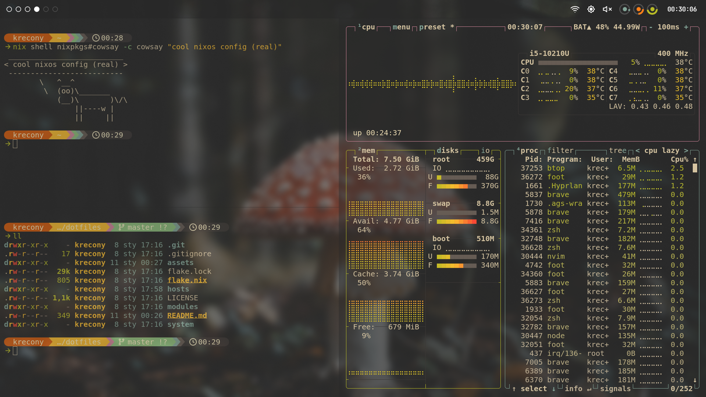

<h1 align="center">NixOS dotfiles   </h1>
my personal NixOS config on which i work on in my free time.

cool widgets made using [ags v1](https://github.com/Aylur/ags)

<h2>screenshots</h2>

<h2>cool configs</h2>

- [sioodmy](https://github.com/sioodmy/dotfiles)
- [Lenny0939](https://github.com/Lenny0939/Nix-Config)
- [Gerg](https://github.com/Gerg-L/nixos)
